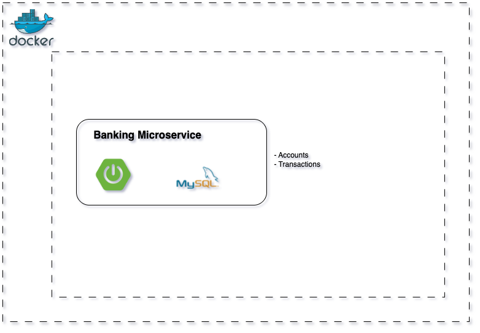

# Arquitectura Hexagonal en Spring Boot

Este proyecto implementa una arquitectura hexagonal con **Spring Boot**, desplegado con **Docker Compose**, que simula un sistema bancario: Cuentas y sus transacciones.

## 📌 Arquitectura  




## 🛠️ Tecnologías usadas 
- **Java 21**
- **Spring Boot 4**
- **Spring Data JPA**
- **MySQL**
- **Docker & Docker Compose**

## 🐳 Docker Compose

El archivo `docker-compose.yml` levanta:

- **Bases de datos**:
  - MySQL para Órdenes (`3306`).

Ejemplo de ejecución:

```bash
docker-compose up -d
```

Verifica que los contenedores estén corriendo:

```bash
docker ps
```


## 🚀 Cómo ejecutar

1. Clonar repositorio:
   ```bash
   git clone ....git
   cd ltd-backing-sb
   ```

2. Levantar infraestructura (DBs):
   ```bash
   docker-compose up -d
   ```

3. Levantar cada microservicio (desde su carpeta):
   ```bash
   mvn spring-boot:run
   ```


## 📬 Postman Collection

Para probar los endpoints del microservicio, puedes importar la siguiente colección en **Postman**:

👉 [Descargar colección de Postman](./banking_sb.postman_collection.json)

1. Abre Postman.
2. Ve a **Importar** → selecciona el archivo `banking_sb.postman_collection.json`.
3. Ejecuta las requests.