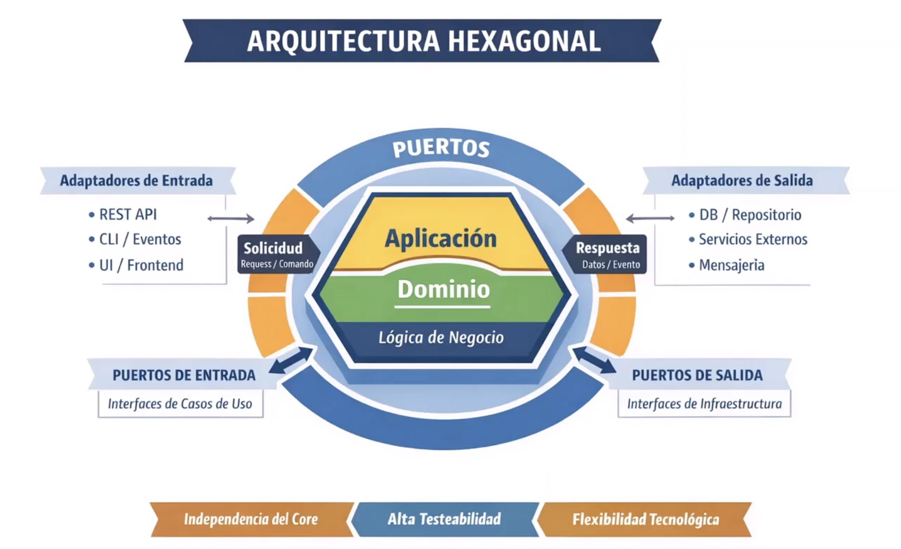
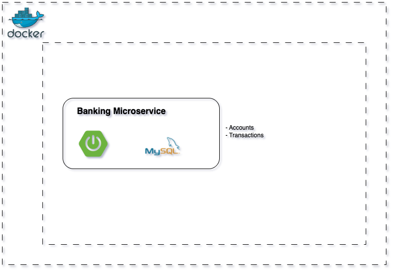

# Arquitectura Hexagonal en Spring Boot

[](https://github.com/leomedinadev/ltd-banking-sb/actions/workflows/ci.yml)

Este proyecto implementa una arquitectura hexagonal con **Spring Boot**, desplegado con **Docker Compose**, que simula un sistema bancario: Cuentas y sus transacciones.

## 📌 Arquitectura  




- **domain**: `Account`, `Money` y `Transaction` con las reglas de negocio (no se puede retirar más del saldo ni operar con montos menores o iguales a cero). No depende de Spring ni de JPA.
- **application**: casos de uso (crear cuenta, depositar, retirar, consultar) y sus puertos.
- **infrastructure**: adaptadores de entrada (REST) y de salida (JPA / MySQL).

Los montos se manejan con `BigDecimal` (2 decimales) y la cuenta usa bloqueo optimista (`@Version`) para que dos operaciones simultáneas no pisen el saldo.

## 🛠️ Tecnologías usadas 
- **Java 21**
- **Spring Boot 4**
- **Spring Data JPA**
- **MySQL**
- **Docker & Docker Compose**
- **JUnit 5** (H2 en memoria para los tests)

## 🐳 Docker Compose

El archivo `docker-compose.yml` levanta:

- **Base de datos**:
  - MySQL para cuentas y transacciones (`3306`).

Ejemplo de ejecución:

```bash
docker compose up -d
```

Verifica que el contenedor esté corriendo:

```bash
docker ps
```

## ⚙️ Variables de entorno

Todas son opcionales: los valores por defecto coinciden con los de `docker-compose.yml`, pensados solo para desarrollo local.

| Variable | Valor por defecto |
|---|---|
| `DB_URL` | `jdbc:mysql://localhost:3306/banking_sb?useSSL=false&serverTimezone=UTC&allowPublicKeyRetrieval=true` |
| `DB_USERNAME` | `admin_banking_sb` |
| `DB_PASSWORD` | `admin_banking_sb` |
| `MYSQL_ROOT_PASSWORD` (solo compose) | `root` |

## 🚀 Cómo ejecutar

1. Clonar repositorio:
   ```bash
   git clone https://github.com/leomedinadev/ltd-banking-sb.git
   cd ltd-banking-sb
   ```

2. Levantar infraestructura (DB):
   ```bash
   docker compose up -d
   ```

3. Levantar el microservicio:
   ```bash
   ./mvnw spring-boot:run
   ```

La API queda en `http://localhost:8080` y Swagger UI en `http://localhost:8080/public/swagger-ui.html`.

## 🔌 Endpoints

| Método | Ruta | Descripción |
|---|---|---|
| `POST` | `/api/accounts` | Crea una cuenta (`customerId`, `initialBalance`) |
| `GET` | `/api/accounts/{id}` | Consulta el saldo y las transacciones |
| `POST` | `/api/accounts/{id}/deposit` | Deposita (`amount`) |
| `POST` | `/api/accounts/{id}/withdraw` | Retira (`amount`) |

Errores: `400` validación o saldo insuficiente, `404` cuenta inexistente, `409` la cuenta fue modificada por otra operación al mismo tiempo.

## 🧪 Tests

```bash
./mvnw verify
```

No necesitan MySQL ni Docker: usan H2 en memoria.

## 📬 Postman Collection

Para probar los endpoints del microservicio, puedes importar la siguiente colección en **Postman**:

👉 [Descargar colección de Postman](./banking_sb.postman.json)

1. Abre Postman.
2. Ve a **Importar** → selecciona el archivo `banking_sb.postman.json`.
3. Ejecuta las requests.
